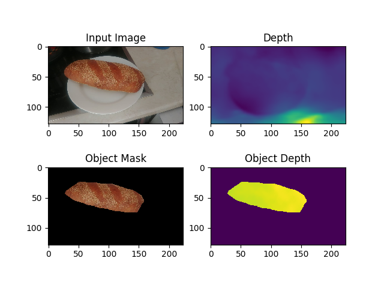
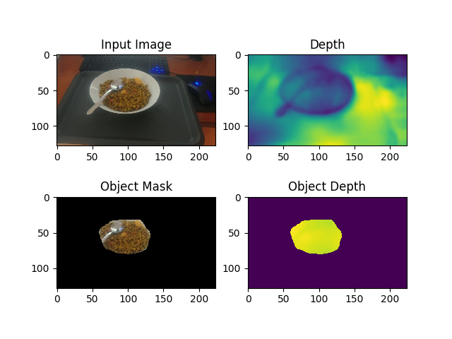
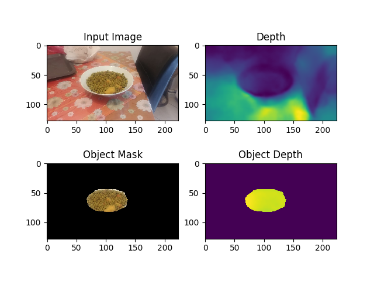
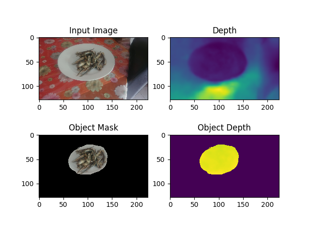

# Food volume estimation
This project aims to establish a method for image-based food volume estimation
using deep learning monocular depth estimation techniques.

## Todo
- Calibrate depth predictions. Find a rescaling factor that maps predicted
  depths to real-world depth values.
- Volume estimation is still debated. Fitting volume primitives based on
  food detection seems to be the best approach.
- Train the high-res model (448x256 inputs).

## Done
- Trained low-res model (224x128 inputs) and achieved promising results.
  Examples:
  
<table align="center" width="100%">
  <tr>
    <td>
      <b>Example 1</b>:  
      
    </td>
    <td>
      <b>Example 2</b>:  
      
    </td>
  </tr>
  <tr>
    <td>
      <b>Example 3</b>:  
      
    </td>
    <td>
      <b>Example 4</b>:  
      
    </td>      
  </tr>
</table> 
